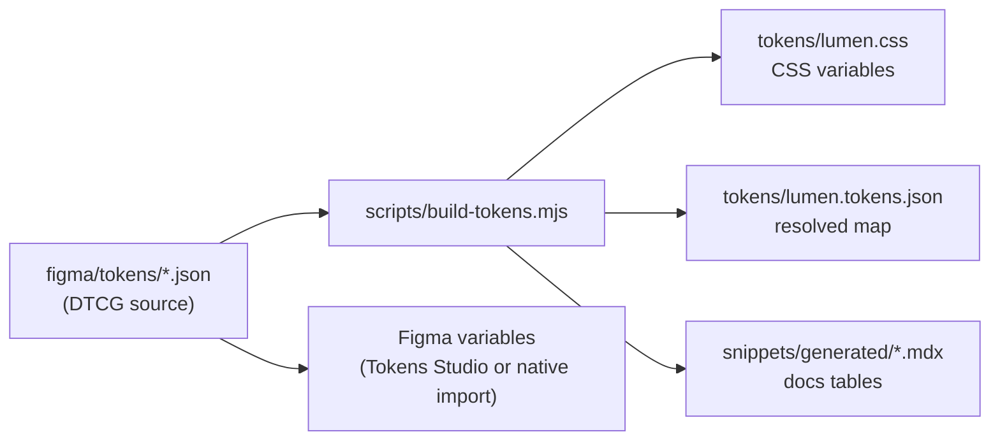

Every visual decision in Lumen is a **design token**. Tokens live in one place, `figma/tokens/`, as [W3C Design Tokens (DTCG)](https://www.designtokens.org/) JSON. A small build script turns them into CSS variables, a resolved JSON map, and the tables in these docs.



## Two tiers of tokens

<Columns cols={2}>
  <Card title="Primitives" icon="swatch-book">
    Raw values with no meaning attached: `color.brand.600`, `space.4`, `radius.md`. They're the palette, not the paint.
  </Card>
  <Card title="Semantic" icon="tags">
    Named by purpose and mode-aware: `color.bg.surface`, `color.text.secondary`, `color.border.focus`. Components use these, and only these.
  </Card>
</Columns>

A semantic token is an alias to a primitive, with one value per mode:

```json figma/tokens/semantic/light.json
{
  "color": {
    "bg": {
      "brand": { "$type": "color", "$value": "{color.brand.600}" }
    }
  }
}
```

```json figma/tokens/semantic/dark.json
{
  "color": {
    "bg": {
      "brand": { "$type": "color", "$value": "{color.brand.500}" }
    }
  }
}
```

## Using tokens in CSS

Import the stylesheet once. Every token becomes a `--lumen-*` custom property, named by joining its path with dashes.

```css
@import "@lumen/tokens/lumen.css";

.settings-panel {
  background: var(--lumen-color-bg-surface);
  border: var(--lumen-border-width-thin) solid var(--lumen-color-border-default);
  border-radius: var(--lumen-radius-lg);
  padding: var(--lumen-space-6);
  box-shadow: var(--lumen-shadow-sm);
}

.settings-panel h2 {
  font: var(--lumen-typography-heading-md);
  letter-spacing: var(--lumen-typography-heading-md-letter-spacing);
  color: var(--lumen-color-text-primary);
}
```

Type styles are also available as utility classes, such as `lumen-text-body-sm` and `lumen-text-heading-lg`.

<Note>
  This docs site loads the very same generated file, `tokens/lumen.css`. Every preview you see is styled with these variables, so switching the docs to dark mode shows the Lumen dark theme.
</Note>

## Light and dark mode

Semantic variables switch with the `data-theme` attribute (or a `.dark` class) on any ancestor element.

<CodeGroup>
```html Explicit
<html data-theme="dark">
```
```html Follow the OS
<html data-theme="system">
```
```html Scoped section
<section data-theme="dark">
  <!-- Everything in here renders in dark mode -->
</section>
```
</CodeGroup>

`LumenProvider` manages the attribute for you:

```tsx
<LumenProvider theme="system" /> // "light" | "dark" | "system"
```

## Using tokens in JavaScript

```ts
import tokens from "@lumen/tokens/lumen.tokens.json";

tokens.tokens["color.brand.600"].value;       // "#5A35DB"
tokens.tokens["color.bg.surface"].dark;       // "#191C24"
tokens.tokens["space.4"].cssVar;              // "--lumen-space-4"
```

## Overriding tokens

Override **semantic** variables, never primitives, so that both modes stay coherent. Scope overrides to a selector to theme one product area.

```css brand-override.css
/* A teal sub-brand for the Analytics product */
[data-product="analytics"] {
  --lumen-color-bg-brand: #0F766E;
  --lumen-color-bg-brand-hover: #115E59;
  --lumen-color-text-brand: #0F766E;
  --lumen-color-border-focus: #14B8A6;
}
```

<Warning>
  Check contrast whenever you override a color. The build script prints a WCAG report for every key pairing. See [Accessibility](/foundations/accessibility).
</Warning>

## Regenerating tokens

After you edit any JSON file in `figma/tokens/`, rebuild:

```bash
node scripts/build-tokens.mjs          # writes tokens/ and snippets/generated/
node scripts/build-tokens.mjs --check  # CI: fails if generated files are stale or contrast fails
```

See [Design tokens](/resources/design-tokens) for the file layout and naming rules.
